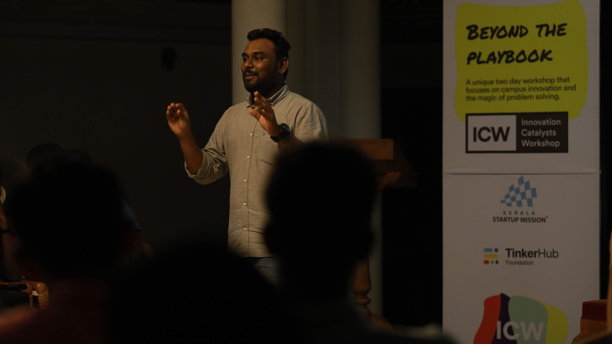

# Kinassery \| Mehar's Digital Garden

"Ideas are perishables"

There are a lot of ideas that come to my mind, grows or dies over time. I wish to document some of them, mostly because I wanted to refer those with people I care about while conversing.

## Intro - About Myself - Mehar

Hi, Mehar here from [TinkerHub](http://tinkerhub.org) is my most common way of introducing myself. That's my public identity these days. I see work as an extension of who am I, even though this is a personal space you could find a lot of things around the domain I work.

I tried to be unique or at least not to fit in the systems. I never find doing anything that anyone else can do as an interesting thing, maybe I'm an original thinker I used to feel at times. I tried to do things that interest me at all points of my life. One lead to another. Organising FOSS events to College Tech Fest to world's largest web maker party - [Maker Party Kochi](https://medium.com/@meharmp/how-i-co-hosted-the-worlds-largest-web-maker-party-started-a-learning-culture-maker-party-9d12719c33be) during college days.

Build apps for Blackberry app world. Bagged some awards limited Edition phones and a decent amount through selling paid apps on store. This happened while I was in third year. Financially independent from that time onwards, made a [series of tweets](https://twitter.com/meharmp/status/1364046436346695680) about that recently. Check out the [Deccan Chronicle article ](https://www.deccanchronicle.com/141216/nation-current-affairs/article/kozhikode-youth-develops-secure-browser-app-blackberry)about my startup life. 

I was running Incubators and Accelerators as part of the [Kerala Startup Mission \(KSUM\)](https://startupmission.kerala.gov.in/). Resigned after 3 years with KSUM and moved full time with TinkerHub Foundation in the mid of 2018.

[Technology Innovation Fellowship program](https://meharmp.medium.com/paid-to-dream-my-journey-as-a-fellow-of-kerala-startup-mission-152f60edfcd6) by Kerala Startup Mission, Kairos Fellowship for young startup entrepreneurs, Global Youth Forum, Global Cooperative Entrepreneurship \(Mentor\) are some of the programs I was part of. Headstart Network to support startup entrepreneurs is my major volunteering experience.

