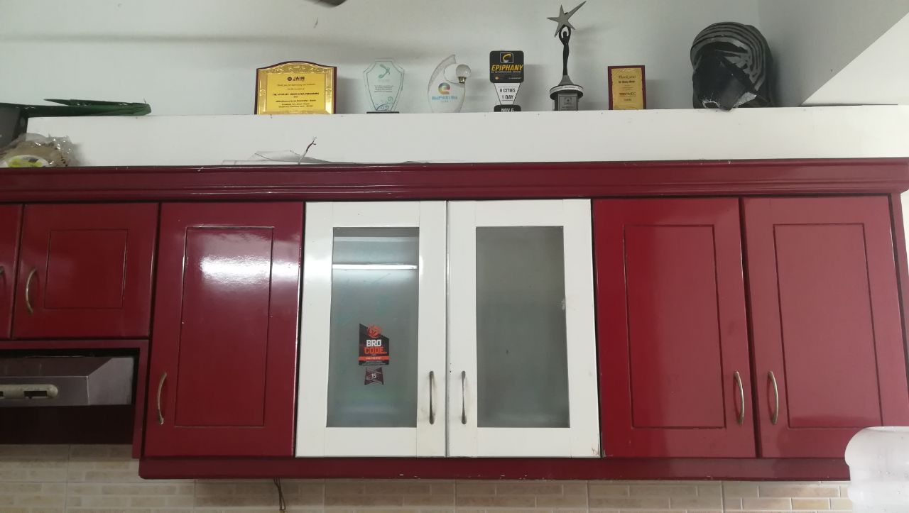

# Rethinking Mementos & Gifts

Visiting colleges, taking sessions is part of my full-time job ever after my college days. Earlier as a fellow of @Kerala startup mission, then as project coordinator and now as @TinkerHub. I can say that I don't have enough place on my showcase in my home to put all the mementoes I have received.

I'm not a great fan of mementoes mainly, it took a lot of places like this, normally it will be heavy and fragile and thirdly there is nothing useful about it that your mom can show the new ones to others.

It was @yadu started giving Plants as mementoes from the @headstart days. Now it became a culture.

Giving plants and books are the best things you can give and receive as mementoes. I still think about the talk at MEC because watering this small guy is part of my morning routine.

This book is something I received last weekend from TKM. I hope more people will move from expensive mementoes that is only useful to boost our egos to something like these Which will get us connected to nature and make us more connected.

