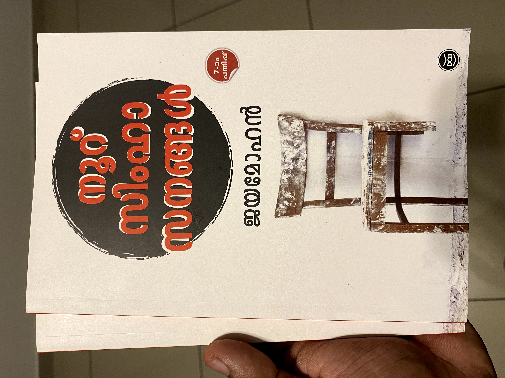

# Nooru Simhasangal Book

Nooru Simhasangal \( A hundred thrones \)by Jayamohan is one of the books that helped me to grow as a person. It helped me to see things that were around me and never saw before because of my privileges.

‌ After reading this I could see things are so subtle and might not notice if we are from a privileged background.

