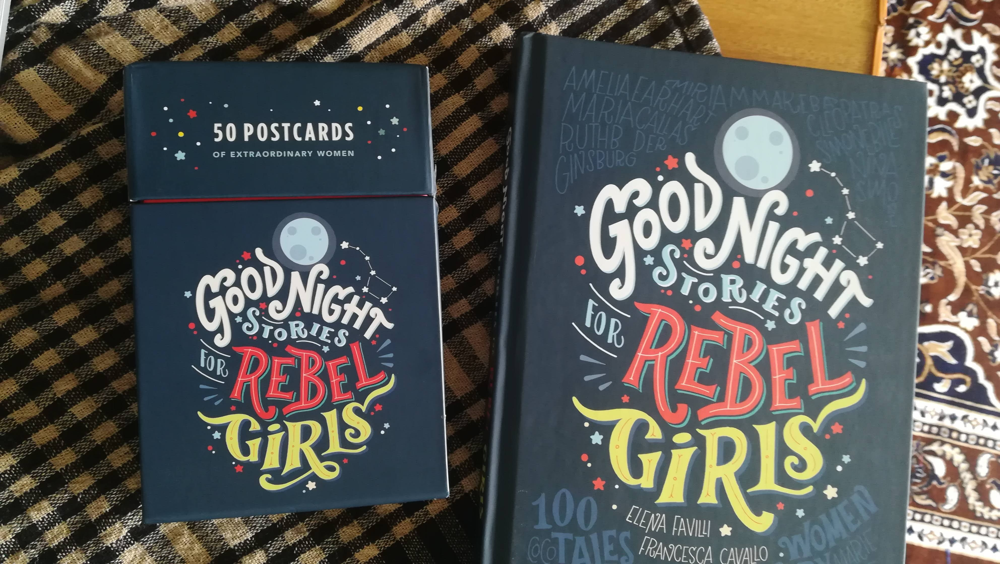

# Good Night Stories for Rebel Girls

[Good Night Stories for Rebel Girls](https://www.rebelgirls.com/) is one of my all-time favourite social projects. It's a collection of stories of amazing women & their work in a good night story format.

## Why this matters 

We all learn from our surroundings, societies & people around us. When a young girl grows up in a patriarchal society, the images she might get about women might not be inspiring. If you dont see enough women doing leadership roles, taking ownership of lives & standing for themselves, the growing girls might believe it's okay, you cant dream big or it's a men's world, you dont have enough say in it.

## How it started

A couple of years back, maybe I was still in college then, I saw a video randomly on Facebook. This was that video & you will pretty much understand the why's.

[https://www.youtube.com/watch?v=Z1Jbd4-fPOE](https://www.youtube.com/watch?v=Z1Jbd4-fPOE)



Spend 3 minutes 18 seconds on it, you won't regret it.

## How it works

The book & the project is already a success. The core principles that made the success in my perspective are

#### Relatability

When 'people like us' do things, we tend to do believe that we too can do that.



#### Goodnight stories format

In the US & all, there is the custom of parents reading books to children just before they sleep, sitting next to the child in the bed. The child tends to be more interested in hearing stories in a good night stories format. 'like long long ago there was this girl who always wanted to fly....'

#### Curation

The team carefully curated the stories considering what we wanted the child to hear.

## 

